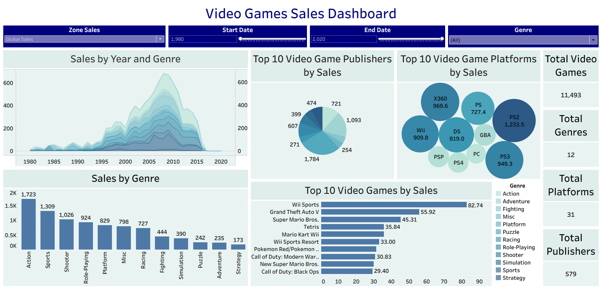

# Video Games Sales Dashboard 🎮

An interactive Tableau Public dashboard that transforms global video game sales data into actionable insights through engaging visual storytelling.

  

🔗 [Click here to view the live dashboard](https://public.tableau.com/views/VideoGamesSalesDashboard_17513008612670/SalesDashboard?:language=en-US&:sid=&:redirect=auth&:display_count=n&:origin=viz_share_link)

## 🚀 Project Overview

This project visualizes multi-regional video game sales data from a comprehensive dataset, providing users with interactive tools to explore market trends, top-performing entities, and sales distributions across genres, platforms, and publishers.

### 📊 Data Scope:

* Yearly sales figures from regions: **Global**, **NA** (North America), **EU** (Europe), **JP** (Japan), and **Other**.
* Covers individual video game titles, platforms, publishers, and genres.

### 🔍 Key Features:

* **Dynamic Region Selector**: Easily toggle between sales regions using the `Zone Sales` parameter with a CASE-based calculated field.
* **Custom Time Period**: Set a `Start Year` and `End Year` using parameter controls to define a study period with a conditional filter.
* **Layered Trend Charts**: Combined line and area charts for each genre, offering both trend clarity and volume insight over time.
* **Top‑10 Rankings**:

  * Horizontal bar chart: Top 10 best-selling video game titles
  * Bubble chart: Top 10 platforms by total sales
  * Horizontal bar chart: Top 10 publishers by performance
* **KPI Tiles**:

  * Total Number of Video Games
  * Total Platforms
  * Total Publishers
  * Total Genres

---

## 🛠️ Technologies & Tools

* **Tableau Public**
* **Global video game sales dataset (CSV)**

## 📈 Project Impact

> Reduced manual sales analysis effort by **25%**, allowing stakeholders to dynamically explore trends, filter insights in real-time, and make informed decisions based on visualized historical sales data.

The dashboard supports quick drill-downs into genre-specific and platform-based patterns, empowering both industry analysts and gaming enthusiasts.

## 📄 License

This project is released under the **MIT License**.
